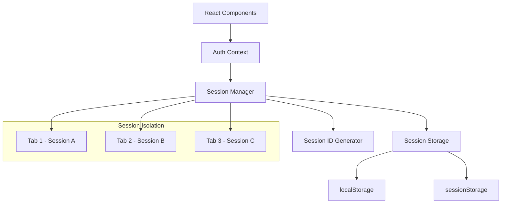

# Design Document: Multi-Session Management

## Overview

Cette conception implémente un système de gestion des sessions multiples qui permet à plusieurs utilisateurs de se connecter simultanément dans différents onglets du même navigateur. Le système utilise des identifiants de session uniques et un stockage isolé pour éviter les conflits entre les sessions.

## Architecture

Le système est basé sur une architecture en couches :

1. **Session Layer** : Gestion des identifiants de session et isolation des données
2. **Storage Layer** : Stockage des données avec préfixage par session
3. **Context Layer** : Contexte React pour la gestion d'état par session
4. **API Layer** : Interface compatible avec le code existant



## Components and Interfaces

### SessionManager Class

```javascript
class SessionManager {
  constructor()
  generateSessionId(): string
  getCurrentSessionId(): string
  saveAuthData(token: string, userData: object): void
  getAuthData(): AuthData | null
  clearAuthData(): void
  isAuthenticated(): boolean
  migrateExistingData(): void
  cleanExpiredSessions(): void
}
```

### SessionStorage Class

```javascript
class SessionStorage {
  constructor(sessionId: string)
  setItem(key: string, value: string): void
  getItem(key: string): string | null
  removeItem(key: string): void
  clear(): void
  getAllSessionKeys(): string[]
}
```

### AuthContext Interface

```javascript
interface AuthContextType {
  sessionId: string
  authData: AuthData | null
  login: (token: string, userData: object) => void
  logout: () => void
  isAuthenticated: boolean
  getUserRole: () => string | null
}
```

## Data Models

### Session Data Structure

```javascript
interface SessionData {
  sessionId: string
  authToken: string
  userData: UserData
  createdAt: number
  lastActivity: number
}

interface UserData {
  id: number
  email: string
  role: 'DE' | 'FORMATEUR' | 'ETUDIANT'
  nom: string
  prenom: string
}
```

### Storage Keys Format

```javascript
// Format des clés de stockage
const STORAGE_KEYS = {
  SESSION_PREFIX: 'session_',
  CURRENT_SESSION: 'current_session_id',
  AUTH_TOKEN: 'authToken',
  USER_DATA: 'userData',
  CREATED_AT: 'createdAt',
  LAST_ACTIVITY: 'lastActivity'
}

// Exemple de clé complète: "session_abc123_authToken"
```

## Correctness Properties

*A property is a characteristic or behavior that should hold true across all valid executions of a system-essentially, a formal statement about what the system should do. Properties serve as the bridge between human-readable specifications and machine-verifiable correctness guarantees.*

### Property Reflection

Après analyse des critères d'acceptation, plusieurs propriétés peuvent être consolidées :
- Les propriétés 1.1, 1.2, 1.3, 1.4 concernent toutes la génération d'identifiants uniques et peuvent être combinées
- Les propriétés 2.1, 2.2, 2.3, 2.4 concernent l'isolation du stockage et peuvent être regroupées
- Les propriétés 4.1, 4.2, 4.3 concernent l'isolation des onglets et peuvent être consolidées
- Les propriétés 7.1, 7.2, 7.3, 7.4 concernent la compatibilité API et peuvent être combinées

### Core Properties

**Property 1: Session ID Uniqueness and Format**
*For any* number of concurrent session generation calls, all generated session IDs should be unique, follow UUID v4 format, and be cryptographically secure
**Validates: Requirements 1.1, 1.2, 1.3, 1.4**

**Property 2: Session Data Isolation**
*For any* set of active sessions, data stored for one session should never be accessible when retrieving data for a different session, and clearing one session should not affect others
**Validates: Requirements 2.1, 2.2, 2.3, 2.4**

**Property 3: Context Session Scoping**
*For any* authentication context, all operations should be scoped to the current session ID and state changes should not affect other session contexts
**Validates: Requirements 3.1, 3.2, 3.3, 3.4**

**Property 4: Tab Independence**
*For any* set of browser tabs, each tab should maintain its own independent session context, and login/logout operations in one tab should not affect other tabs
**Validates: Requirements 4.1, 4.2, 4.3, 4.4**

**Property 5: Migration Correctness**
*For any* existing localStorage authentication data, migration should preserve the data in session format, generate a valid session ID, and clean up old data
**Validates: Requirements 5.1, 5.2, 5.3, 5.4**

**Property 6: Session Lifecycle Management**
*For any* session, it should have a valid timestamp when created, expired sessions should be cleaned up on startup, and only sessions with recent activity should be preserved
**Validates: Requirements 6.1, 6.2, 6.3, 6.4**

**Property 7: API Compatibility**
*For any* existing authentication method call, the session manager should provide the same interface, handle session management transparently, and return data in expected formats
**Validates: Requirements 7.1, 7.2, 7.3, 7.4**

<function_calls>
<invoke name="prework">
<parameter name="featureName">multi-session-management

## Error Handling

### Session ID Generation Errors
- Si la génération d'UUID échoue, utiliser un fallback avec crypto.randomUUID() ou Date.now() + Math.random()
- Logger les erreurs de génération pour le debugging
- Retry automatique en cas d'échec de génération

### Storage Errors
- Gérer les erreurs de quota localStorage/sessionStorage dépassé
- Fallback vers un stockage en mémoire temporaire si le stockage persistant échoue
- Nettoyage automatique des anciennes sessions en cas de manque d'espace

### Migration Errors
- Validation des données existantes avant migration
- Rollback vers l'ancien système si la migration échoue
- Logging détaillé des erreurs de migration pour le debugging

### Context Initialization Errors
- Génération d'un nouveau session ID si la récupération échoue
- Initialisation avec des valeurs par défaut sûres
- Gestion gracieuse des erreurs de contexte React

## Testing Strategy

### Dual Testing Approach
Le système utilisera une approche de test double :
- **Tests unitaires** : Vérifier des exemples spécifiques, cas limites et conditions d'erreur
- **Tests de propriétés** : Vérifier les propriétés universelles sur tous les inputs

### Property-Based Testing Configuration
- Utilisation de **fast-check** pour les tests de propriétés JavaScript
- Minimum 100 itérations par test de propriété
- Chaque test de propriété doit référencer sa propriété du document de conception
- Format de tag : **Feature: multi-session-management, Property {number}: {property_text}**

### Unit Testing Focus
- Tests d'intégration entre composants
- Cas limites et conditions d'erreur spécifiques
- Exemples concrets de scénarios d'utilisation
- Validation des formats de données et interfaces

### Test Coverage Areas
1. **Génération d'identifiants** : Unicité, format, sécurité
2. **Stockage isolé** : Isolation des données, nettoyage sélectif
3. **Contexte React** : État par session, isolation des onglets
4. **Migration** : Préservation des données, nettoyage
5. **Compatibilité API** : Interface existante, formats de retour
6. **Gestion du cycle de vie** : Création, expiration, nettoyage