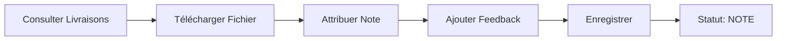

# Fonctionnalités de Livraison et d'Évaluation des Travaux

## 📋 User Stories Implémentées

### 🎓 Étudiant - Livraison de Travail
**En tant qu'Étudiant, je veux soumettre (livrer) mon travail de production pour un travail individuel donné, afin de le rendre visible au formateur pour évaluation.**

#### Fonctionnalités :
- ✅ Consultation de la liste des travaux assignés
- ✅ Filtrage des travaux (En cours, Rendus, Notés)
- ✅ Upload de fichier avec glisser-déposer
- ✅ Ajout de commentaire optionnel
- ✅ Validation de la taille de fichier (max 10MB)
- ✅ Vérification des échéances
- ✅ Téléchargement de sa propre copie
- ✅ Visualisation des notes et feedback reçus

#### Interface :
- **Composant principal** : `MesTravaux.jsx`
- **Modal de livraison** : `LivrerTravail.jsx`
- **Accès** : Dashboard Étudiant → "Mes Travaux"

### 👨‍🏫 Formateur - Évaluation de Travail
**En tant que Formateur, je veux évaluer un travail livré en attributant une note et un commentaire, afin de fournir un retour pédagogique et valider l'acquisition des compétences.**

#### Fonctionnalités :
- ✅ Consultation des travaux créés
- ✅ Visualisation de toutes les livraisons par travail
- ✅ Téléchargement des fichiers livrés
- ✅ Attribution de notes (avec validation)
- ✅ Ajout de feedback détaillé
- ✅ Suivi du statut des assignations
- ✅ Interface intuitive avec aperçu étudiant

#### Interface :
- **Composant principal** : `EvaluerTravail.jsx`
- **Accès** : Dashboard Formateur → Espace → "Évaluer travaux"

## 🛠️ Architecture Technique

### Backend (FastAPI)
```
back/routes/travaux.py
├── POST /api/travaux/livrer/{id_assignation}     # Livraison de travail
├── GET  /api/travaux/mes-travaux                 # Liste des travaux étudiant
├── GET  /api/travaux/travail/{id_travail}/livraisons  # Livraisons d'un travail
├── POST /api/travaux/evaluer/{id_livraison}      # Évaluation d'une livraison
└── GET  /api/travaux/telecharger/{id_livraison}  # Téléchargement de fichier
```

### Frontend (React)
```
front-react/src/components/forms/
├── MesTravaux.jsx          # Interface étudiant
├── LivrerTravail.jsx       # Modal de livraison
├── EvaluerTravail.jsx      # Interface formateur
├── CreateTravail.jsx       # Création de travaux
└── AssignerTravail.jsx     # Assignation aux étudiants
```

### Base de Données
```sql
-- Table des livraisons
CREATE TABLE livraison (
    id_livraison VARCHAR(100) PRIMARY KEY,
    id_assignation VARCHAR(100) REFERENCES assignation(id_assignation),
    chemin_fichier VARCHAR(255) NOT NULL,
    date_livraison DATETIME DEFAULT CURRENT_TIMESTAMP,
    commentaire TEXT,
    note_attribuee DECIMAL(3,1),
    feedback TEXT
);

-- Statuts d'assignation
ENUM StatutAssignationEnum {
    ASSIGNE,    -- Travail assigné
    RENDU,      -- Travail livré
    NOTE        -- Travail évalué
}
```

## 🔄 Workflow Complet

### 1. Création et Assignation (Formateur)


### 2. Livraison (Étudiant)


### 3. Évaluation (Formateur)


### 4. Consultation Résultats (Étudiant)


## 🔐 Sécurité et Permissions

### Contrôles d'Accès
- **Livraison** : Seul l'étudiant assigné peut livrer
- **Évaluation** : Seul le formateur de l'espace peut évaluer
- **Téléchargement** : 
  - Étudiant : sa propre livraison uniquement
  - Formateur : livraisons de ses espaces
  - DE : accès complet

### Validations
- **Fichiers** : Taille max 10MB, types autorisés
- **Notes** : Comprise entre 0 et note_max du travail
- **Échéances** : Vérification côté client et serveur
- **Doublons** : Impossible de livrer deux fois le même travail

## 📊 Fonctionnalités Avancées

### Filtrage et Recherche
- **Étudiant** : Filtres par statut (En cours, Rendus, Notés)
- **Formateur** : Vue globale des livraisons par travail
- **Tri** : Par date, statut, note

### Notifications
- **Email automatique** lors de l'assignation
- **Feedback visuel** pour les actions (succès/erreur)
- **Indicateurs visuels** pour les échéances dépassées

### Interface Utilisateur
- **Drag & Drop** pour l'upload de fichiers
- **Aperçu temps réel** des sélections
- **Responsive design** pour mobile/tablette
- **Thème sombre/clair** supporté

## 🧪 Tests

### Script de Test Automatisé
```bash
# Lancer le serveur backend
cd back
python -m uvicorn main:app --reload

# Dans un autre terminal, lancer les tests
python test_livraison_evaluation.py
```

### Scénarios Testés
1. **Connexion** des différents types d'utilisateurs
2. **Livraison** d'un travail par un étudiant
3. **Évaluation** par un formateur
4. **Téléchargement** des fichiers
5. **Vérification** de la visibilité des notes

## 📱 Utilisation

### Pour l'Étudiant
1. Se connecter au système
2. Aller dans "Mes Travaux"
3. Sélectionner un travail non livré
4. Cliquer sur "Rendre le travail"
5. Uploader le fichier et ajouter un commentaire
6. Confirmer la livraison

### Pour le Formateur
1. Se connecter au système
2. Aller dans un espace pédagogique
3. Cliquer sur "Évaluer travaux"
4. Sélectionner une livraison
5. Télécharger et examiner le fichier
6. Attribuer une note et un feedback
7. Enregistrer l'évaluation

## 🚀 Améliorations Futures

### Fonctionnalités Potentielles
- **Travaux en groupe** avec gestion collaborative
- **Versions multiples** de livraisons
- **Annotations** directes sur les fichiers
- **Grilles d'évaluation** personnalisables
- **Statistiques avancées** de performance
- **Export** des notes en CSV/Excel
- **Plagiat detection** intégrée
- **Notifications push** en temps réel

### Optimisations Techniques
- **Compression** automatique des fichiers
- **Stockage cloud** (AWS S3, etc.)
- **Cache** pour les téléchargements fréquents
- **API pagination** pour les grandes listes
- **Websockets** pour les mises à jour temps réel

---

## 📞 Support

Pour toute question ou problème concernant ces fonctionnalités :
1. Consulter cette documentation
2. Vérifier les logs du serveur
3. Tester avec le script automatisé
4. Contacter l'équipe de développement

**Status** : ✅ Fonctionnalités complètes et opérationnelles